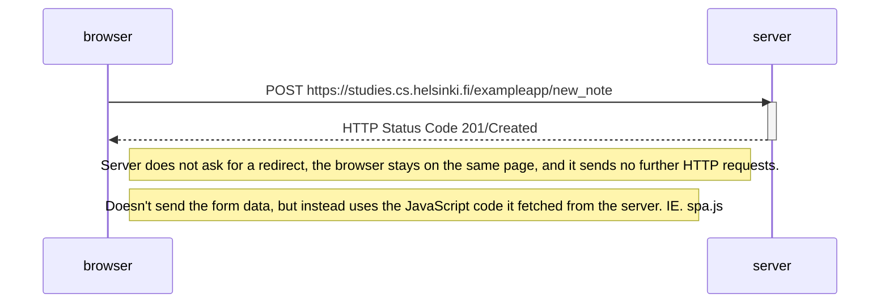

```mermaid
sequenceDiagram
    participant browser
    participant server

    browser->>server: POST https://studies.cs.helsinki.fi/exampleapp/new_note
    activate server
    server-->>browser: HTTP Status Code 201/Created
    deactivate server

    Note right of browser:  Server does not ask for a redirect, the browser stays on the same page, and it sends no further HTTP requests. 
    Note right of browser: Doesn't send the form data, but instead uses the JavaScript code it fetched from the server. IE. spa.js

```
